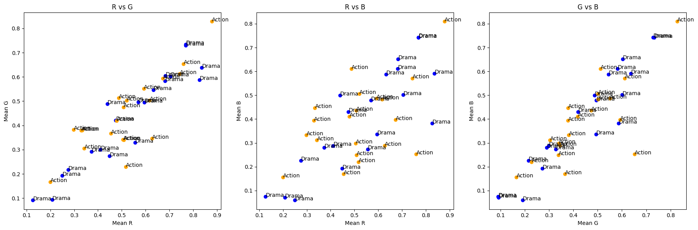

# Movie Genre Classification via Poster Color Analysis

## Project Overview

Color is a powerful communication tool used to convey mood, tone, and influence physiological reactions. This project quantifies this visual communication by training models to distinguish between genres based solely on pixel data. To evaluate the relationship between colour and genre, three machine learning algorithms (KNN, logistic regresion & NN) were tested using **5-fold cross-validation**.

## Preprocessing

### Data Pipeline:
1.  **Cleaning:** Removed classes with no images and filtered out oversampled genres to ensure statistical significance.
2.  **Resizing:** Standardized all images to 350X350 pixels and converted them into NumPy arrays for efficient matrix calculation.
3.  **Feature Selection:** Visual inspection revealed that **Mean Red** and **Mean Blue** were the most distinguishable features for classification.

4.  **Genre Selection:** Focused on **Action** and **Drama** as they showed the lowest co-occurrence, making them the most distinct pairs for binary classification.

## Models & Results

### 1. K-Nearest Neighbours (KNN) - **75.0% Accuracy**
* **Logic:** Makes decisions based on the proximity of data points in the feature space.
* **Dimensionality:** Utilized mean RGB values to avoid the "curse of dimensionality" (367,500 pixels per image).
* **Configuration:** $k=5$.

### 2. Logistic Regression - **78.1% Accuracy**
* **Logic:** Models the probability of a genre (0 or 1) using a linear relationship with color features.
* **Pros:** Highly interpretable and efficient for binary classification tasks.

### 3. Neural Network (Deep Learning) - **78.12% Accuracy**
* **Architecture:** A 7-layer dense network ($512 \rightarrow 256 \rightarrow 128 \rightarrow 64 \rightarrow 32 \rightarrow 16 \rightarrow 2$).
* **Activation:** **ReLU** for hidden layers to prevent vanishing gradients; **Sigmoid** for the final output.
* **Regularization:** A dropout rate of **0.3** was applied to encourage robust, distributed representations of data.

---